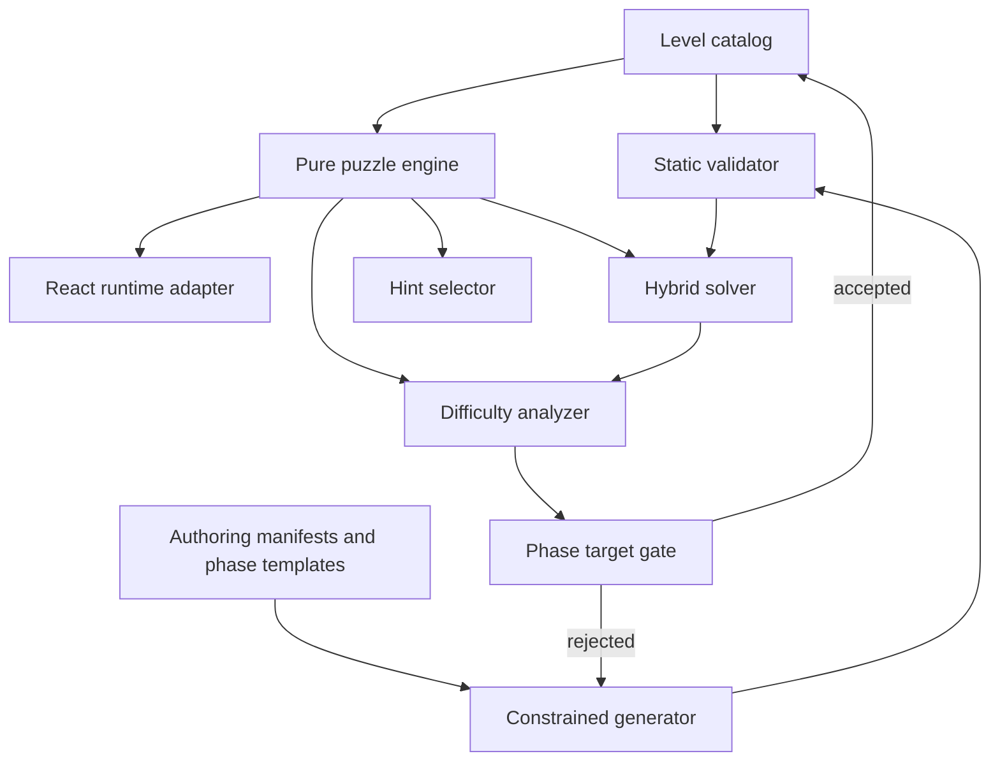

# Target Architecture

## Architectural objective

Create one authoritative, browser-independent puzzle domain. Runtime, hints, validator, solver, analyzer, and generator must depend on the same transition rules.



## Required dependency direction

```text
Shared primitive types
        ↓
Pure puzzle domain
        ↓
Runtime adapter / validator / solver / analyzer / generator
        ↓
React UI and CLI entry points
```

No pure-domain module may import from a runtime, persistence, React, Pixi, GSAP, CSS, DOM, localStorage, Web Audio, or browser-timer module.

## Exact target file layout

The implementing agent must create or converge on this layout. Existing symbols may be moved, but public runtime behavior must be updated atomically.

```text
src/features/tribe-out/
├── types.ts
├── levels.ts                         # generated runtime catalog; do not hand-edit
├── gameLogic.ts                      # runtime adapter, lives/stars/status
├── gameLogic.test.ts
├── tribeOutStorage.ts
├── tribeOutStorage.test.ts
├── puzzle/
│   ├── types.ts
│   ├── geometry.ts
│   ├── occupancy.ts
│   ├── engine.ts
│   ├── serialization.ts
│   ├── selectors.ts
│   ├── index.ts
│   ├── geometry.test.ts
│   ├── engine.test.ts
│   └── serialization.test.ts
└── ...existing runtime UI files

scripts/levels/
├── cli/
│   ├── validate.ts
│   ├── solve.ts
│   ├── report.ts
│   └── generate.ts
├── catalog/
│   ├── phaseDefinitions.ts
│   ├── phase1Authored.ts
│   ├── phase2Blueprints.ts
│   ├── phase3Blueprints.ts
│   ├── phase4Blueprints.ts
│   ├── phase5Blueprints.ts
│   └── manifests.ts
├── generator/
│   ├── random.ts
│   ├── embedBlueprint.ts
│   ├── phase1.ts
│   ├── phase2.ts
│   ├── phase3.ts
│   ├── phase4.ts
│   ├── phase5.ts
│   └── generateCatalog.ts
├── validation/
│   ├── issueCodes.ts
│   ├── validateLevel.ts
│   ├── validateCatalog.ts
│   └── validateLevel.test.ts
├── solver/
│   ├── types.ts
│   ├── exitClosure.ts
│   ├── fastSolver.ts
│   ├── statefulSolver.ts
│   ├── priorityQueue.ts
│   ├── solveLevel.ts
│   └── solveLevel.test.ts
├── analyzer/
│   ├── types.ts
│   ├── dependencyGraph.ts
│   ├── causalDepth.ts
│   ├── analyzeLevel.ts
│   ├── aggregateReport.ts
│   └── analyzeLevel.test.ts
├── reports/
│   ├── writeJson.ts
│   ├── writeCsv.ts
│   └── writeMarkdown.ts
└── fixtures/
    ├── geometryFixtures.ts
    ├── solverFixtures.ts
    ├── analyzerFixtures.ts
    └── migrationFixtures.ts

tsconfig.tools.json
```

The exact internal split may be adjusted only when the live source requires a mechanically equivalent path. Any path adjustment must preserve responsibilities and be documented in the completion report.

## Module ownership

### Pure puzzle domain

Owns:

- entity footprints;
- board bounds;
- occupancy;
- forward path calculation;
- exit legality;
- legal puzzle actions;
- rotate legality and direction changes;
- escaped-unit state;
- switch traversal and activation;
- gate opening;
- puzzle completion;
- canonical state serialization.

### Runtime adapter

Owns:

- lives;
- blocked-tap bump feedback;
- playing/won/lost status;
- stars;
- timer;
- hint usage count and highlight lifecycle;
- selected rotate tool UI state;
- animation and audio notifications;
- persistence calls;
- overlays and navigation.

### Persistence

Owns:

- schema parsing;
- legacy migration;
- sanitization;
- stable level IDs;
- unlock/current/stars persistence;
- localStorage failure fallback.

### CLI tools

Own:

- structural validation;
- solver search and diagnostics;
- difficulty analysis;
- phase-specific generation;
- deterministic report output.

## Generated-data ownership

`src/features/tribe-out/levels.ts` is generated output. Do not edit it directly after the new generator exists.

Its source inputs are the phase catalog modules and manifests under `scripts/levels/catalog/`.

`npm run levels:generate` must write to a temporary file, validate, solve, analyze, and only then atomically replace `levels.ts`.
